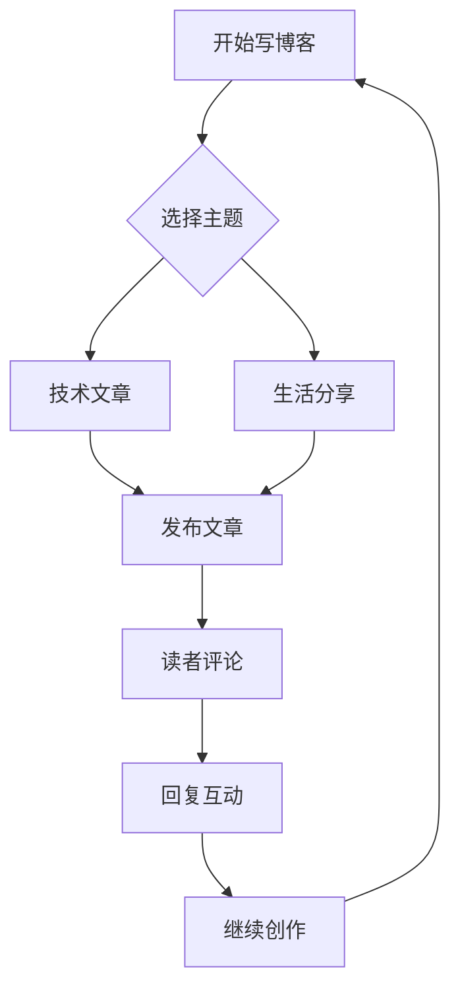
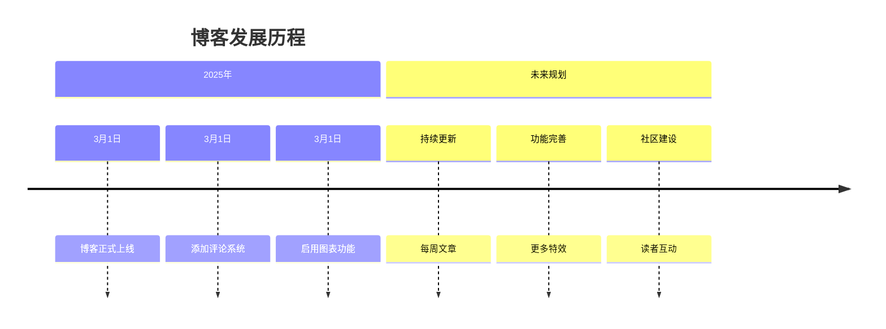
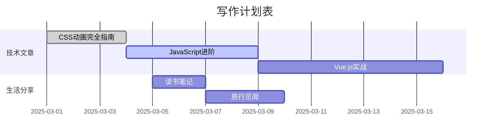

# 🎉 博客功能展示与使用教程

欢迎来到我的博客！这篇教程将向你展示博客的所有强大功能。

## 📋 目录导航
[[toc]]

## 💬 评论系统

博客现在支持 **Twikoo 评论系统**，你可以：

- 在每篇文章下方留言评论
- 支持 Markdown 语法
- 支持表情符号
- 支持图片上传
- 支持匿名和登录评论

> **💡 提示**：点击评论框上方的"使用其他方式登录"可以选择不同的登录方式。

## 📊 Mermaid 图表支持

博客现在支持 Mermaid 图表语法，可以绘制各种精美的图表！

### 流程图



### 时间线



### 甘特图



## 🎨 视觉特效

博客添加了多种视觉特效，让浏览体验更加丰富：

### 🌟 背景动画
- **Canvas Nest**: 动态连线背景效果
- **Fluttering Ribbon**: 飘动的彩带效果
- 移动端适配，效果更流畅

### 🎆 点击特效
- **烟花效果**: 点击页面会出现绚丽的烟花
- **文字气泡**: 点击会显示随机的表情符号
- 所有效果都针对性能优化，不影响浏览体验

### 🌈 主题配色
重新设计了配色方案：
- **主色调**: 紫色系 (#425AEF)
- **强调色**: 温暖的红色和黄色
- **代码高亮**: 优化的代码显示效果

## 📝 Markdown 增强功能

### 代码块功能
```javascript
// 支持 macOS 风格的代码块
const greeting = "欢迎来到我的博客！";
console.log(greeting);

// 支持自动换行和语法高亮
function enhanceBlog() {
    addVisualEffects();
    enableComments();
    optimizePerformance();
}
```

### 表格支持
| 功能 | 状态 | 说明 |
|------|------|------|
| 评论系统 | ✅ 已启用 | Twikoo 评论系统 |
| 图表支持 | ✅ 已启用 | Mermaid 图表语法 |
| 打赏功能 | ✅ 已启用 | 微信/支付宝打赏 |
| RSS订阅 | ✅ 已启用 | 支持文章订阅 |
| 懒加载 | ✅ 已启用 | 图片和内容懒加载 |

## 💖 打赏支持

如果你觉得文章对你有帮助，可以通过以下方式支持我：

1. **文章下方打赏按钮**：点击"打赏"按钮
2. **扫码支付**：支持微信和支付宝
3. **精神支持**：点赞、评论、分享都是支持

> 所有打赏将用于维护博客服务器和购买更多学习资源。感谢你的支持！🙏

## 📧 联系方式与互动

### 社交链接
- 🐙 **GitHub**: [@MIXUULSS](https://github.com/MIXUULSS)
- 📧 **邮箱**: mixuu10001@gmail.com
- 🔗 **博客**: https://lssblog.us.kg

### 订阅方式
1. **RSS订阅**: 点击导航栏的"订阅"按钮
2. **浏览器收藏**: Ctrl+D 收藏网站
3. **社交媒体关注**: 关注我的GitHub获取更新

## 🚀 写作指南

### 文章格式模板
```markdown
---
title: 文章标题
date: 2025-03-01 14:00:00
author: LSS
tags: ["标签1", "标签2"]
categories: ["分类名"]
excerpt: 文章摘要
cover: /img/cover.jpg
toc: true
---

文章内容...
```

### 支持的功能
- ✅ 数学公式: `$E=mc^2$` 或 `$$...$$`
- ✅ 代码块: 支持语法高亮和复制
- ✅ 图片懒加载: 自动优化加载速度
- ✅ 灯箱效果: 点击图片放大查看
- ✅ 目录生成: 自动生成文章目录
- ✅ 文章字数统计: 显示阅读时间

## 📈 SEO 优化

博客配置了完整的 SEO 优化：

- 🔍 **搜索引擎友好**: 优化的 meta 标签
- 📱 **响应式设计**: 适配各种设备
- ⚡ **加载速度优化**: CDN 和懒加载
- 📊 **结构化数据**: 便于搜索引擎理解

## 🔮 未来规划

### 短期目标
- [ ] 添加更多主题切换选项
- [ ] 集成更多第三方服务
- [ ] 优化移动端体验
- [ ] 添加文章搜索功能

### 长期目标
- [ ] 多语言支持
- [ ] 社区功能
- [ ] 开放API
- [ ] 个人品牌建设

---

## 🎯 结语

这就是我的博客功能展示！希望你喜欢这个设计精良、功能丰富的个人博客。

**有什么建议或想法吗？** 欢迎在下方留言评论！你的反馈对我很重要。

**感谢你的阅读！** 如果觉得有用，别忘了点个赞或打赏支持一下哦！ 🎊

> 💡 **小贴士**: 订阅我的博客，第一时间获取最新文章更新！